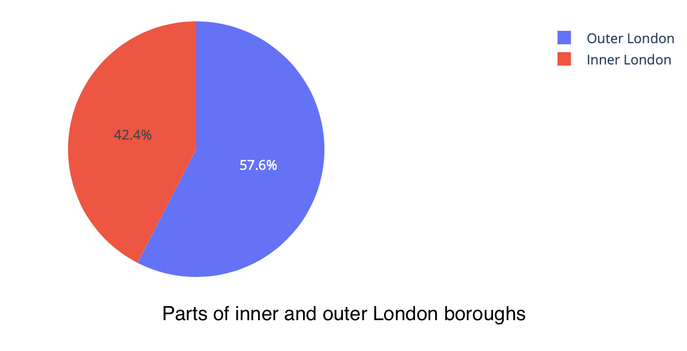
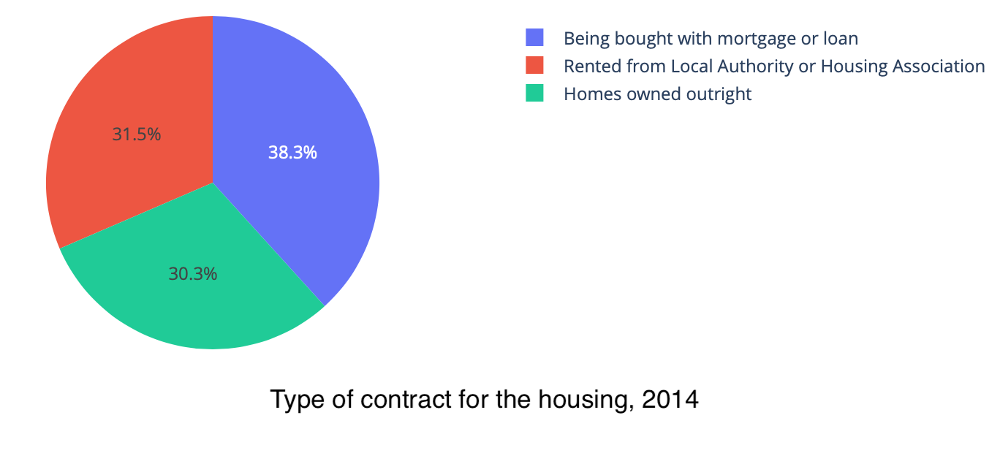
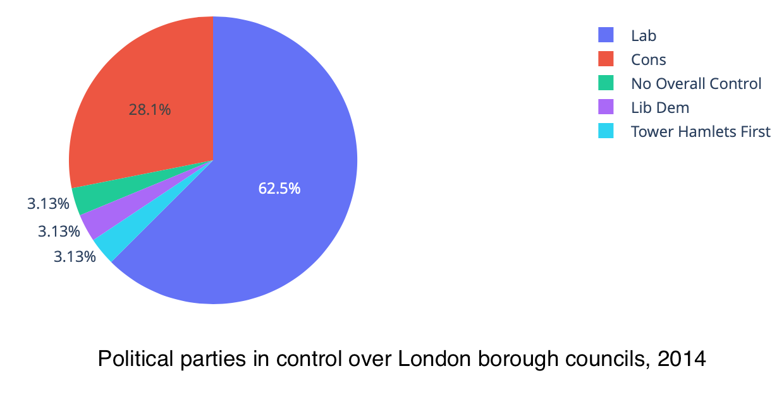

Housing is an important component of everyone's life. After all, your home is where you spend most of your week, particularly in these trouble times. Does your neighborhood, that you now know by heart since lockdown, contribute to your happiness?

# Why this study?

Cattaneo and al., in their paper *Housing, Health and Happiness*, discuss the influence of housing on health and welfare by studying the impact of a large-scale household Mexican government program, Piso Firme. That program aimed to replace household dirt floors by cement floors to improve standards of living. In particular, what is interesting for us, is that they found that housing upgrades significantly improve adult welfare, as measured by increased satisfaction with their housing and quality of life, as well as lower depression and perceived stress. This raises an interesting point: **How does their findings generalize to other cities? Is it possible to establish links between housing and life satisfaction in a big European city?** We decided to extend their work by looking at data from housing in London.

We explore the possibility to find such housing influence through London boroughs. If our study context is certainly different from theirs (the housing conditions in these two countries are rather different, dirt floors are not ), we also compare information of small closely related locations (London boroughs, while they use two twin cities of Mexico) to uncover the influence of housing in these neighborhoods on their inhabitants' life. 

What if we could establish the influence of numerous housing variables, such as prices, neighbourhoods (and conditions) on your life satisfaction and happiness in the city of London? We would be able to tell you where you should live to make your life great!

But also, can politicians use your housing and neighbourhood conditions to know if you will vote for them? We further extend our research on whether political opinion is defined by these conditions, to find which neighborhoods are won by which party.

## Index
1. [Does location define life satisfaction or is it defined by standard of living (job, house price)?](#part1)
    1. [What could influence your happiness?](#part1a)
    2. [Are you really happier if you live in inner London?](#part1b)
2. [Can we group neighborhoods by looking at well being, security and economic stability?](#part2)
    1. [Are neighborhoods really that different?](#part2a)
    2. [Borough groups](#part2b)
3. [Can we predict political control based on life satisfaction and housing conditions?](#part3)
    1. [Do people vote significantly differently based on their life satisfaction and housing?](#part3a)
    2. [Can politicians know your political preferences based on where you live?](#part3b)
4. [Conclusion](#conclusion)

Let's first have some insights on the data we have. 
We have information for the 33 boroughs of London. They are all classified as inner or outer boroughs.

We also have some other information, such as the age distribution over all boroughs, divided in three classes: 0-15 years old, working-age, and over 65 years old.

The housing can be separated in three types, based on how the homes are owned. These three classes are: homes owned outright (that is, full price was paid with the household's own money); homes bought with mortgage or with a loan; homes rented from a local authority or a housing association). Let's see how housing is shared among these three classes.

As we are also concerned with the political control in council, let's visualise the share of neighborhoods controlled by each party.

Let's also have a look at housing prices across the boroughs. -> put distribution graph

And last but not least: let's see if the four well-being scores variables, being life satisfaction, happiness, worthwhileness and anxiety, are any different between the boroughs. -> put distribution graph for these 4 things

 
 
-> put visualization such as borough number, number inner and outer london
-> pie plot with groups of political countrol, age groups across london as a whole, type of house possession in groups across London

# 1. Location and life satisfaction
Are you more satisfied with your life if you live in a particular borough of London? For instance, are inhabitants of Kensington and Chelsea, the most expensive borough of London, happier than others? 

***Let's find out.***

## 1.1. What could influence your happiness?
To discover what makes people satisfied with their life, we think about what could make people happy with their housing conditions. Let's observe for instance the employment rate, the household income, the life satisfaction score, and the happiness score of Londong boroughs in relation to their location.
-> put the graphs investigating the variables used in this question + describe this and make the conclusions.

We identify the following parameters to be of potential influence for your happiness, life satisfaction, worthwhileness, and anxiety:
- PUT VARIABLES SELECTED AS CONTROLS FOR Q1

***Now, get ready to discover how to be happy in London.***

## 1.2. What really makes you happy
After some visual investigation, we could think that, for instance, people living in inner London boroughs are happier. So does your housing location really define your happiness? To answer this, we use different linear regression models. In model 1, we only tried to predict life satisfaction in function of whether the borough was located in inner or outer London. In model 2, we added the possible influence of health and safety in the neighborhood. In model 3 we additionally used the influence of employment rates and income. From this, we conclude the significance and thus importance of parameters defining your life satisfaction, happiness, worthwhileness and anxiety. 
-> put graph with 100%-pvalue to show significance
Write conclusions

We can deduce that the life satisfaction score, the worthwhileness score as well as the happiness score can very well be predicted from location in all three models. Well, this means that all these scores can be predicted by location. Sorry folks, but people living in inner London are indeed happier!

However, anxiety is hardly predictable by your location, so maybe try some other things than moving to a new borough to reduce your stress (it will probably cost less anyway).

But could the standard of living also be used to predict life satisfaction? We chose to test a prediction with the criteria of salary, median house price, crime rates and if the house was owned outright. Can any of these parameters predict the life satisfation score, happiness score, worthwhileness score or anxiety score? 

-> put results from second figure Q1

We see that the crime rates per thousand population alone cannot predict any of these scores, meaning that having high numbers of crimes in your neighborhood doesn't affect your personal life that much (well, until that happens to you).

For the median house price alone, we see that it is very efficient to predict the anxiety score, but not the other scores. 

In terms of gross annual pay, it is not surprising to find that earning more money can help reducing your anxiety, as well as increasing your happiness. However, you're not more satisfied with your life if you earn more. 

But what's interesting here, is that how you own your house is a powerful predictor for all 4 scores. Having your home owned outright, that is, having full possession of your home (meaning you paid all of it directly with your own money, no loan) has a significant influence on your life satisfaction, happiness, worthwhileness and anxiety.

To conclude:
- Your location does define your life satisfaction, worthwhileness, and happiness, but not your anxiety.
- However, some standards of living such as annual pay, house price and how you own your home can also predict these scores.

We can thus answer that life satisfaction can be particularly defined by whether a home was owned outright and by location. 

So to be one of the happiest persons of London, you should live in inner London and own your home outright! ***Simple, right?***

But let's go a bit further.

# 2. Neighborhoods
We found that location does define your happiness. But are neighboorhoods that different? Can we find some differences so important that they define clusters of boroughs?

## 2.1. Finding borough groups
What could make your neighborhood so great compared to others? Let's visualize some infos for the boroughs.
-> put graphs/figures concerning the boroughs

With this in mind, let's select some factors that could help us identify boroughs with a lot in common. We selected:
- PUT VARIABLES SELECTED FOR Q2

***Now, let's dive into the real stuff.***

## 2.2. How are these groups defined?
It is quite possible to group neighborhoods by looking at well-being, security and economic stability. We were able to find 5 groups of boroughs. By going back to the original data, we can show the groups using a map of London. And well, we find that the boroughs clustered together were usually belonging to the same London region (inner/outer london, geographic location)!

-> present each of the three big groups, give numbers for these groups (for each variable, the mean of each groups for instance)

#### But, what are these two lonely neighborhoods?
Two neighborhoods cannot be linked to any others? **Why?** 

If they are solo, it must be because they are very different from the others! Let's find out why ...

The first outlier is the **City of London**. This does not mean London Town, but rather the historical and central primary business of London. This a major business and financial center, mostly consisting of companies and business group headquarters. Its characteristics are quite different from other boroughs, but what makes it that different? Let's look at some numbers:
-> put numbers for that neighborhood, in comparison with other neighborhoods)

We see that the City is different on many aspects. For instance, -> put conclusions of numbers for the city of london. This explains why the City of London can't be associated to any other borough.

The second outlier is **Westminster**. A very touristic borough with high frequentation rates, where the Westminster abbaye and the Big Ben can be seen. But what makes it so different from others? Let's look at some numbers again.
-> put numbers 

If the large majority of parameters are within the normal range, one variable is particularly high in this borough: the crime rates. The crime rates per thousand population in Westminster is almost 3 times higher as the london mean crime rates per thousand population. (put small barplot for this). This added to the tourists everywhere, probably not a great place to live in London ...

If we did find some borough clusters, we see that it isn't easy to group the neighborhoods in very distinct clusters. This is not really surprising, as real human data is usually defined by many variables, and they are probably not all included in that analysis. 

But can we find significant differences between neighborhoods in terms of life satisfaction, happiness, worthwhileness and anxiety, significant enough to uncover groups of neighborhoods? We found that it was not the case. This indicates that well-being variables by themselves cannot explain the neighborhood groups.

To conclude, it is possible to group London neighborhoods, showing that well being, security and economic stability **together** are important life components that create some differences between neighborhoods in London.

**Until now,** we found that location, standards of living, neighborhood and housing conditions can all help predict your happiness, and lead to significant differences between boroughs. We know what this means for you: happier, less anxious, in short, you now have all the keys to have a better life!

But what does all this mean for the powerful political men and women of London? How can they win you over based on what they know about you?

# 3. Policital control in council
Let's visualize some information about the boroughs in relation to the political party in control there.
-> map with political control, some variables in relation to political control

For this analysis, we will restrict ourselves to the two major londonian parties, the Labour and Conservative parties.

With all this, we can identify the variables that could influence why a party has the control in council in a neighborhood:
- PUT VARIABLES USED IN Q3

So now, can we predict for which party you vote based on all this information? Let's find out.

## 3.1. Influence of life satisfaction on political control
Using some logistic regression models, we want to establish the signifiance of multiple parameters in predicting the political contronl in council of a borough, we selected multiple types of variables, belonging to location, happiness, age, life comfort, and security criteria. Here's what we found in terms of importance for each parameter: ->put graph 100%-pvalues

Well, it's nice, we now know which factors influence significantly the political orientation of a borough. But what can we do with this?

Let's say that we want to predict for politicians the political orientation of a neighborhood they like to win.

***Let's do it!***

## 3.2. What does this mean for a politician?
We selected potentially interesting variables. From this, we predict the majority party of each borough, and we get a 67.5% prediction accuracy (meh not too bad). Let's see how this accuracy transcribes geographically.

-> put map of prediction compared to reality
-> put confusion matrix

We see that we are not too far from reality! But let's find a reason for all the wrongly predicted boroughs ...
-> explain class imbalance
-> try the prediction of percentage and then choose best percentage as winning party

# Conclusion

[//]:#(---------- END OF WHAT IS VISIBLE ----------------)
