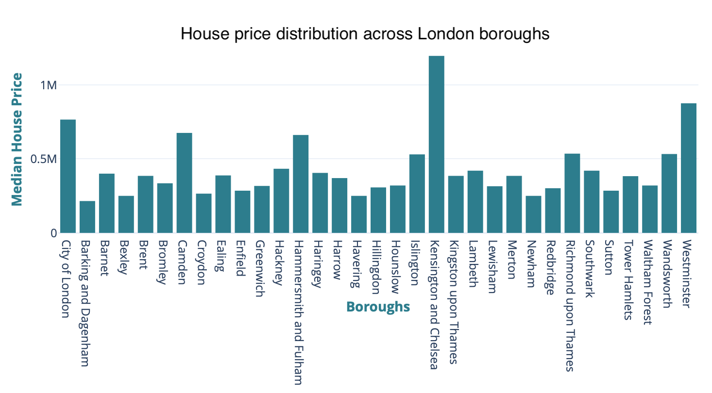
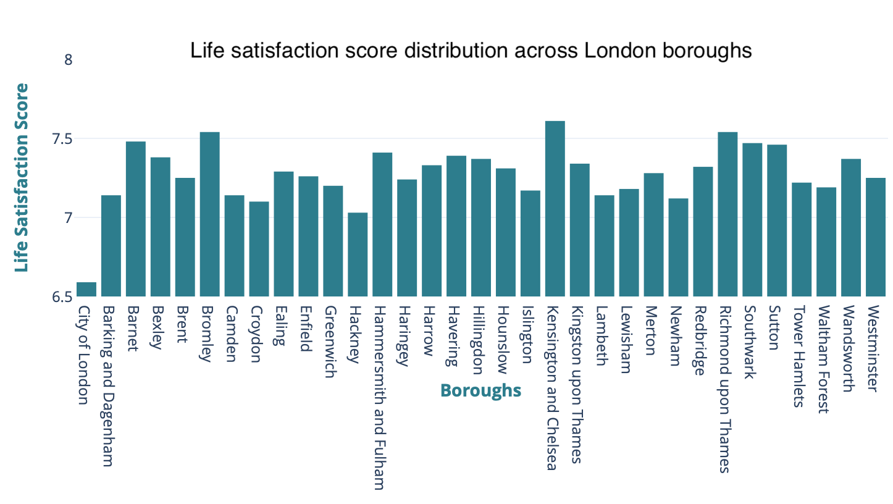
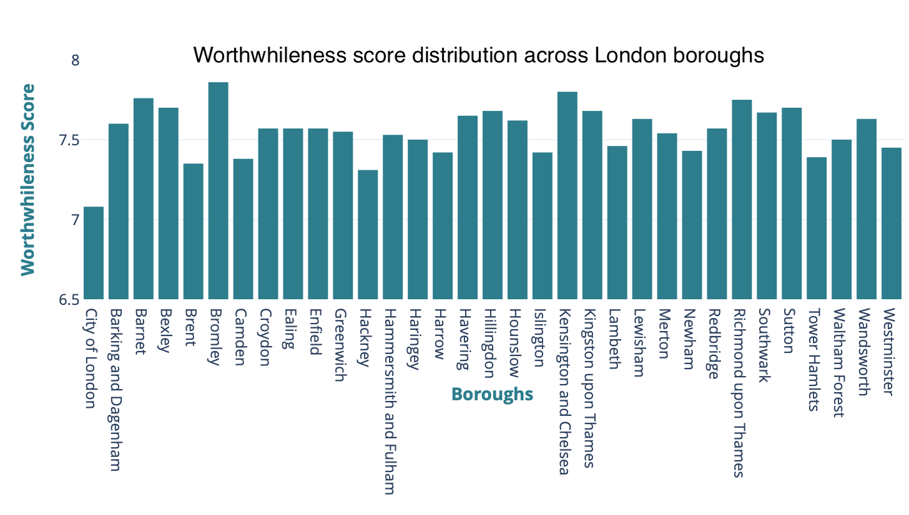
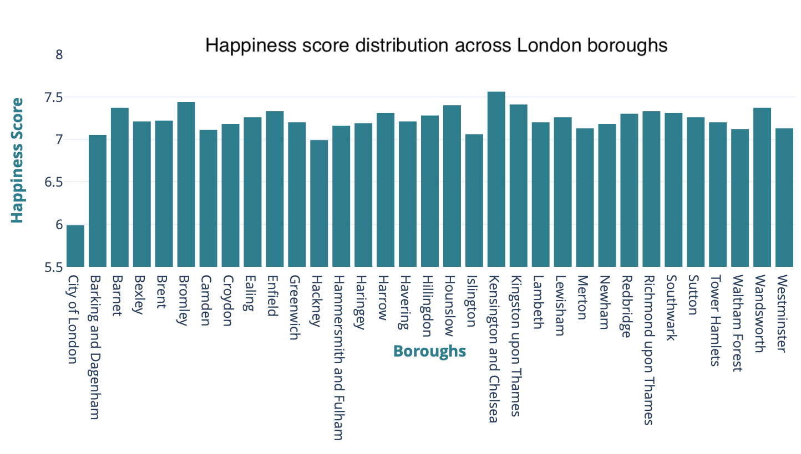
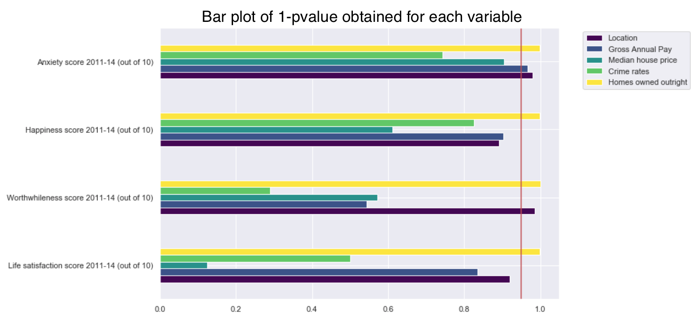
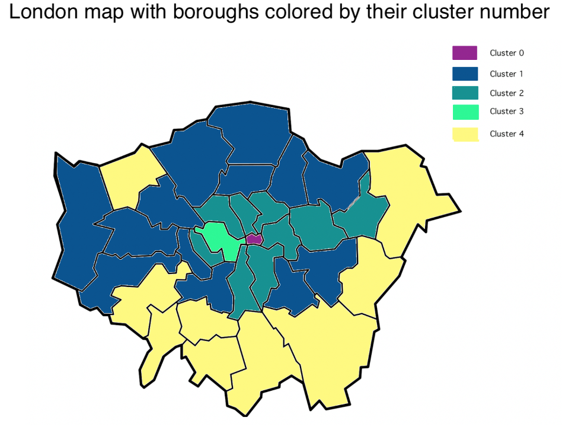

Housing is an important component of everyone's life. After all, your home is where you spend most of your time, particularly in these trouble times. Does your neighborhood, that you have now come to know by heart since lockdown, contribute to your happiness?

# Why this study?

Cattaneo and al., in their paper *Housing, Health and Happiness*, discuss the influence of housing on health and welfare by studying the impact of a large-scale household Mexican government program, Piso Firme. That program aimed to replace household dirt floors by cement floors to improve standards of living. What is particularly interesting for us is that they found that housing upgrades significantly improve adult welfare, as measured by an increased satisfaction with their housing and quality of life, as well as lower depression and perceived stress. This raises an interesting point: **How does their findings generalize to other cities? Is it possible to establish links between housing and life satisfaction in a big European city?** We decided to extend their work by looking at data about housing in London.

We explore the possibility to find such an influence from housing in the London boroughs. If the context of this second study is certainly different from theirs (the housing conditions in these two countries are rather different), we do also compare information of small closely related locations (London boroughs in our case and two twin cities of Mexico in theirs) to uncover the influence of housing conditions on their inhabitants' life in these neighborhoods. 
We won't look at health-related happiness in the same way, as this first paper investigates issues that they do happen in the London, but mostly not due to housing conditions (anemia, parasites, ...). However, life satisfaction and happiness indices can still be investigated in relationship to other housing conditions. 

What if we could establish the influence of numerous housing variables, such as prices, neighbourhoods (and conditions) on your life satisfaction and happiness in the city of London? We would be able to tell you where you should live to make your life great!

But also, can politicians use your housing and neighbourhood conditions to know if you will vote for them? We further extend our research on whether political opinion is defined by these conditions. We investigate whether some significant differences can be found between neighborhoods controlled by Labour or Conservative parties.

## Index
1. [Does location define life satisfaction or is it defined by standard of living (job, house price)?](#part1)
    1. [What could influence your happiness?](#part1a)
    2. [Are you really happier if you live in inner London?](#part1b)
2. [Can we group neighborhoods by looking at well being, security and economic stability?](#part2)
    1. [Are neighborhoods really that different?](#part2a)
    2. [Borough groups](#part2b)
3. [Is political control based on life satisfaction and housing conditions?](#part3)
    1. [Do we observe differences between neighborhoods with different political controls?](#part3a)
    2. [Can politics explain significant differences between neighborhoods concerning life satisfaction and housing?](#part3b)
4. [Conclusion](#conclusion)

Let's first have some insights on the data we have. 
We have information for the 33 boroughs of London. They are all classified as inner or outer boroughs.

We also know the age distribution over all boroughs which can be divided into three classes: 0-15 years old, working-age, and over 65 years old.

Housing can be separated into three categories, based on how the homes were acquired. These three classes are: homes owned outright (that is, full price was paid with the household's own money); homes bought with mortgage or with a loan; homes rented from a local authority or a housing association). Let's see how housing is shared among these three classes.

As we are also interested in the political control in council, let's visualise the share of neighborhoods controlled by each party.

Let's also have a look at housing prices across the boroughs. We see that one neighborhood in particular shows particularly high prices for housing: Kensington and Chelsea. This neighborhood is considered to be one of the most expensive in London, and the housing prices in this borough clearly reflect that. 

And last but not least: let's see if the four well-being scores variables, being life satisfaction, happiness, worthwhileness and anxiety, are any different between the boroughs.
First looking at the life satisfaction, we see that all boroughs have a score between 7 and 7.6 our of 10, except for the City of London, otherwise all boroughs are within the same range. Why is the City of London so different? Let's see if it's an outlier for the other three scores.

Let's now have a look at the worthwhileness score across the London boroughs. Here, all boroughs have a score in the same range, around 7.5 out of 10, while again the City of London is quite different from others with a score closer to 7.

The happiness score is distributed in the same way. If all boroughs have a happiness score around 7.25, the City of London is the only one with a score inferior to 6.5. 

The difference between the City and the other neighborhoods is even more clearly visible concerning the anxiety score. The City inhabitants have an anxiety level almost twice as high as the other boroughs, with a score of 5.57 out of 10, and a mean anxiety score across boroughs of 3.3. 

To conclude, we see that the overall range for these four well-being scores is quite small for all boroughs except for one outlier: the City of London. We will see if that will be visible through the second part of this work when we intend to group neighborhoods together based on life and housing conditions.
<a href="#top">Back to top</a> 

# 1. Location and life satisfaction
Are you more satisfied with your life if you live in a particular borough of London? For instance, are inhabitants of Kensington and Chelsea, the most expensive borough of London, happier than others? 

***Let's find out.***

## 1.1. What could influence your happiness?
To discover what makes people satisfied with their life, we think about what could make people happy with their housing conditions. Let's observe for instance the employment rate, the household income, the life satisfaction score, and the happiness score of Londong boroughs in relation to their location.
-> put the graphs investigating the variables used in this question + describe this and make the conclusions.

We identify the following parameters to be of potential influence for your happiness, life satisfaction, worthwhileness, and anxiety. We can separate them into four groups: 

Health: 
- % of area that is Greenspace, 2005                             
- Male life expectancy, (2012-14)                                
- Female life expectancy, (2012-14)

Safety: 
- Crime rates per thousand population 2014/15

Income: 
- Median House Price, 2014                                     
- Being bought with mortgage or loan, (2014) %                    
- Rented from Local Authority or Housing Association, (2014) %
- Modelled Household median income estimates 2012/13   

Employment rates: 
- Unemployment rate (2015)                                        
- Gross Annual Pay, (2015)                                           
- Jobs Density, 2014   

***Now, get ready to discover how to be happy in London.***

## 1.2. What really makes you happy
After some visual investigation, we could think that, for instance, people living in inner London boroughs are happier. So does your housing location really define your happiness? To answer this, we use different linear regression models. In model 1, we only tried to predict life satisfaction in function of whether the borough was located in inner or outer London. In model 2, we added the possible influence of health and safety in the neighborhood. In model 3 we additionally used the influence of employment rates and income. From this, we conclude the significance and thus importance of parameters defining your life satisfaction, happiness, worthwhileness and anxiety. 

The black line on the histogram is here to show you that any bar that goes further than this has a p-value of less than 0.05 which means that we can reject the null hypothesis with a 5% probability that the null is correct (and the results are random). We can therefore accept the alternative hypothesis that all these scores can be predicted bylocation. 
(IS THAT WHAT YOU WANTED AS CONCLUSION ?)
Write conclusions

We can deduce that the life satisfaction score, the worthwhileness score as well as the happiness score can very well be predicted from location in all three models. Well, this means that all these scores can be predicted by location. Sorry folks, but people living in inner London are indeed happier!

However, anxiety is hardly predictable by your location, so maybe try some other things than moving to a new borough to reduce your stress (it will probably cost less anyway).

We also wonder if the standard of living also be used to predict life satisfaction? We chose to test a prediction with the criteria of salary, median house price, crime rates and if the house was owned outright. Can any of these parameters predict the life satisfation score, happiness score, worthwhileness score or anxiety score? 

Just like in the figure above, the black line on the histogram is here to show you which p-value is lower than 0.05 and thus what null hypothesis we can reject with a 5% probability that the null is correct (and the results are random). 

We see that the crime rates per thousand population alone cannot predict any of these scores, meaning that having high numbers of crimes in your neighborhood doesn't affect your personal life that much (well, until that happens to you).

For the median house price alone, we see that it is very efficient to predict the anxiety score, but not the other scores. 

In terms of gross annual pay, it is not surprising to find that earning more money can help reducing your anxiety, as well as increasing your happiness. However, you're not more satisfied with your life if you earn more. 

But what's interesting here, is that how you own your house is a powerful predictor for all 4 scores. Having your home owned outright, that is, having full possession of your home (you paid all of it directly with your own money and received no loan) has a significant influence on your life satisfaction, happiness, worthwhileness and anxiety.

To conclude:
- Your location does define your life satisfaction, worthwhileness, and happiness, but not your anxiety.
- However, some standards of living such as annual pay, house price and how you own your home can also predict these scores.

We can thus answer that life satisfaction can be particularly defined by whether a home was owned outright and by location. 

So to be one of the happiest persons of London, you should live in inner London and own your home outright! ***Simple, right?***

But let's go a bit further.
<a href="#top">Back to top</a> 

# 2. Neighborhoods
We found that location does define your happiness. But are neighboorhoods that different? Can we find some differences so important that they define clusters of boroughs?

## 2.1. Finding borough groups
What could make your neighborhood so great compared to others? Let's visualize some infos for the boroughs.
-> put graphs/figures concerning the boroughs

With this in mind, let's select some factors that could help us identify boroughs with a lot in common. We selected:
- Employment rate
- Households median income
- Crime rates per thousand population 
- Life satisfaction score 
- Worthwhileness score 
- Happiness score 
- Anxiety score

***Now, let's dive into the real stuff.***

## 2.2. How are these groups defined?
It is quite possible to group neighborhoods by looking at well-being, security and economic stability. We were able to find 5 groups of boroughs. By going back to the original data, we can show the groups using a map of London. 
Here is a map where each borough is colored in the cluster to which it belongs after the PCA and k-means clustering.

And well, we find that the boroughs clustered together were usually belonging to the same London region (inner/outer london, geographic location)! This is interesting as we didn't use the location information to form the clusters: it means that the variables used in the PCA contain information that can be thought as redondant to the location information.
Concerning the three big groups (that is, the clusters with more than one borough), we can also visualize some differences in the variables chosen, such as mean differences. This could be further investigated through some statistical tests, but we do find that the neighborhoods in each cluster are quite different from each others, as shown here! -> put bar plot comparison for all variables studied (4 well-being + income + employment + crime rates)

#### But, what are these two lonely neighborhoods?
Two neighborhoods cannot be linked to any others? **Why?** 

If they are flying solo, it must be because they are very different from the others! Let's find out why ...

The first outlier is the **City of London**. This does not mean London as a whole, but rather the historical and central primary business center of London. This a major business and financial center, mostly consisting of companies and business group headquarters. Its characteristics are quite different from other boroughs, but what makes it that different? Let's look at some numbers: in comparison to the overall data for the other boroughs, we find that the City of London is an outlier for four of the seven variables used in this part of study. Indeed, it is an extreme borough for all the well-being variables, with the lowest happiness, life satisfaction and worthwhileness scores, and the highest anxiety scores. 

We see that the City is different from other boroughs, particularly concerning the well-being of its inhabitants.This explains why the City of London can't be associated to any other borough.

The second outlier is **Westminster**. A very touristic borough with high frequentation rates, where the Westminster Abbaye and the Big Ben can be seen. But what makes it so different from others? Let's look at some numbers again. Westminster borough is actually quite normal compared to the overall data of the other boroughs. But if the large majority of parameters are within the normal range, one variable is particularly high in this borough: the crime rates. The crime rates per thousand population in Westminster is almost 3 times higher as the london mean crime rates per thousand population. This added to the tourists everywhere, probably doesn't make it a great place to live in London ...

If we did find some borough clusters, we see that it isn't easy to group the neighborhoods in very distinct clusters. This is not really surprising, as real human data is usually defined by many variables, and they are probably not all included in that analysis. 

But can we find significant differences between neighborhoods in terms of life satisfaction, happiness, worthwhileness and anxiety, significant enough to uncover groups of neighborhoods? We found that it was not the case. This indicates that well-being variables by themselves cannot explain the neighborhood groups.

To conclude, it is possible to group London neighborhoods, showing that well being, security and economic stability **together** are important life components that create some differences between neighborhoods in London.
<a href="#top">Back to top</a> 

**Until now,** we found that location, standards of living, neighborhood and housing conditions can all help predict your happiness, and lead to significant differences between boroughs. We know what this means for you: happier, less anxious, in short, you now have all the keys to have a better life!

But what does all this mean for the powerful political men and women of London? Are your political opinions linked to your neighborhood conditions?

# 3. Policital control in council
Let's visualize some information how the political parties control is distributed across boroughs after the 2014 election.

Visually, there does not appear to be any pattern of political parties in control across London. For this analysis, we will restrict ourselves to the two major londonian parties, the Labour and Conservative parties.

The question is, can we identify the variables that could influence why a party has the control in council in a neighborhood? That is, can we observe meaningful differences between boroughs with different political controls? Let's find out.

## 3.1. Boroughs with Labour political control and Conservative political control
Are neighborhoods election results linked to the conditions in the neighborhoods? To identify potential differences between the neighborhoods voting for the different parties, we observe the mean for multiple variables, with an analysis divided into two parts:

First, we will look at the four well-being indices (life satisfaction, happiness, worthwhileness and anxiety), to investigate whether there are some significant differences in well-being between labour-controlled and conservative-controlled boroughs.

Then, we will have the look at the following variables:
- Employment rate
- Household income
- Crime rates
- How are homes owned
- Average age, age class proportion
- House price
- Greenspace in the neighborhood
- Number of cars
- Population density 

First, let's visualise if the variables selected show a mean difference between the two political groups of boroughs. -> mean difference graph

Let's then visualise if the characteristics with potentially different means from the two parts above list are indeed differently distributed between labour boroughs and conservative boroughs. -> put all the small graphs

We see that a lot of parameters seem to have different distributions for the two types of boroughs. We need to verify if there are significant differences.

***Let's do it!***

## 3.2. Are there significant differences for boroughs with different parties in control?
Visually, we established the parameters susceptible to be different between labour-controlled boroughs and conservative-controlled boroughs. But can we trust our eyes? We run some statistical tests to check if indeed we can find some statistical differences between the two parties. Here's what we obtain: ->put p-value importance made as Ariane

So we see that indeed, boroughs with different political controls are characterized by different parameter values! It appears that -> put conclusions from the pvalue 

**Would it be possible to go further?**

With data from other election results, we can see the evolution of the number of boroughs voting for each party. Here we see the number of boroughs controlled by each political party from the 2002 election until the 2018 election results. -> put year election plot

Collecting year-corresponding data from the variables that seem to have significantly different values in Labour and Conservative boroughs could be used to develop a prediction model, allowing politicians to visualise which neighborhoods they can hope to win based on the life and housing conditions in these neighborhoods.
<a href="#top">Back to top</a> 

# Conclusion 

[//]:#(---------- END OF WHAT IS VISIBLE ----------------)
